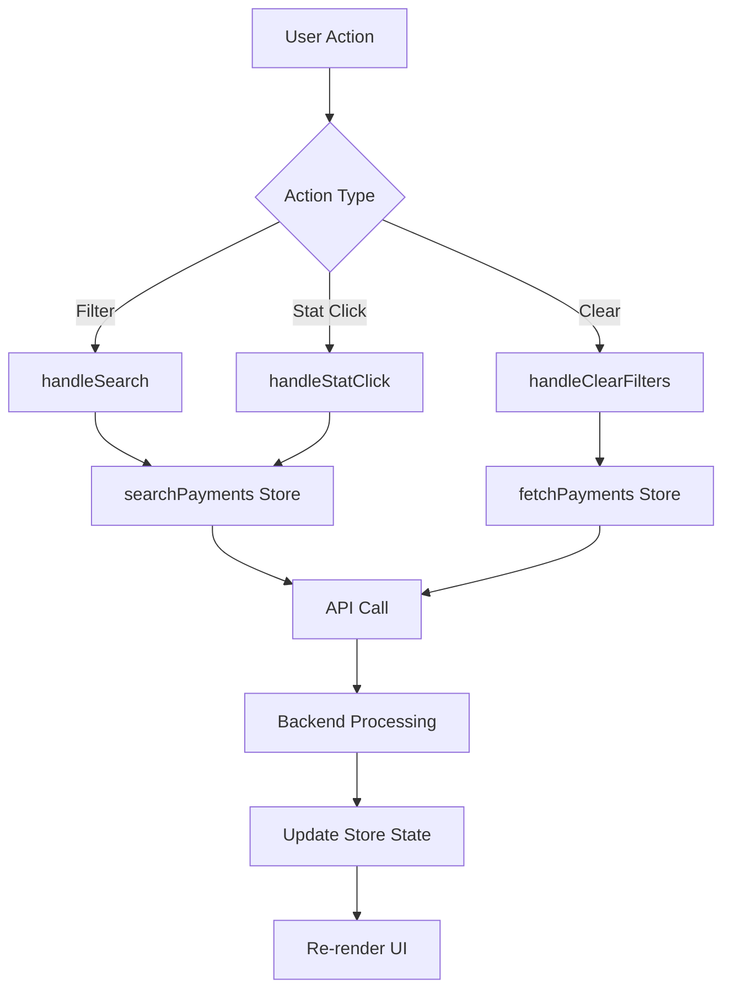

# Payment Received - Filter, Stats & Search Implementation

## 🎯 Overview

Complete implementation of filtering, statistics, and search functionality for the Payment Received module.

---

## ✅ Features Implemented

### 1. **Advanced Filtering System**

Located in: `src/components/finance/paymentReceived/PaymentFilters.tsx`

#### Filter Options:

- **Search**: Payment number, client name, or invoice reference
- **Status**: All, Completed, Pending, Failed, Refunded
- **Payment Method**: Cash, Bank Transfer, Cheque, Credit Card, Debit Card, UPI, Other
- **Sort By**: Payment Date, Payment Number, Amount, Status, Created Date
- **Sort Order**: Ascending, Descending
- **Date Range**: From date, To date
- **Amount Range**: Min amount, Max amount

#### Features:

- ✅ Expandable filter panel
- ✅ Active filter count badge
- ✅ Clear all filters button
- ✅ Apply filters button
- ✅ Refresh button
- ✅ Enter key support for quick search

---

### 2. **Real-time Statistics Dashboard**

Located in: `src/components/finance/paymentReceived/PaymentStats.tsx`

#### Stats Cards:

1. **Total Payments**

   - Count of all payments
   - Total amount received
   - Click to view all payments

2. **Completed Payments**

   - Count of completed transactions
   - Total completed amount
   - Click to filter completed only

3. **Pending Payments**

   - Count of pending transactions
   - Total pending amount
   - Click to filter pending only

4. **Failed Payments**
   - Count of failed transactions
   - Total failed amount
   - Click to filter failed only

#### Additional Metrics:

- **Average Payment**: Total amount / Number of payments
- **Success Rate**: (Completed / Total) × 100%
- **Total Value**: Sum of all payment amounts

---

### 3. **Backend API Integration**

#### API Endpoints (`src/api/finance/payment-receivedApi.ts`):

```typescript
// Search with filters
searchPayments(companyId, params): Promise<PaymentListResponse>

// Get statistics
getPaymentStats(companyId): Promise<PaymentStatsResponse>
```

#### Filter Parameters:

- `search`: string
- `status`: string
- `paymentMethod`: string
- `minAmount`: number
- `maxAmount`: number
- `dateFrom`: string (ISO date)
- `dateTo`: string (ISO date)

#### Stats Response:

```typescript
{
  totalPayments: number;
  totalAmount: number;
  completedPayments: number;
  completedAmount: number;
  pendingPayments: number;
  pendingAmount: number;
  failedPayments: number;
  failedAmount: number;
}
```

---

### 4. **State Management**

Located in: `src/stores/financeStore/usePaymentReceivedStore.ts`

#### Store Methods:

- `fetchPayments()`: Load all payments
- `searchPayments(filters)`: Filter payments with API
- `loadPaymentStats()`: Load statistics from API
- `deletePayment(id)`: Delete single payment

#### Store State:

- `payments`: Array of payment records
- `stats`: Statistics object
- `loading`: Loading state
- `error`: Error message
- `companyId`: Current company ID

---

### 5. **Page Implementation**

Located in: `src/app/(dashboard)/finance/(sales)/payment-received/page.tsx`

#### Key Features:

- ✅ Stats cards with click-to-filter
- ✅ Advanced filter panel
- ✅ Real-time search
- ✅ Bulk selection and delete
- ✅ Pagination controls
- ✅ Loading states
- ✅ Empty states

#### User Interactions:

1. **Click on stat card** → Auto-filter by status
2. **Apply filters** → Search with multiple criteria
3. **Clear filters** → Reset to all payments
4. **Search input** → Press Enter to search
5. **Refresh** → Reload current view

---

## 🔧 Technical Implementation

### API Call Flow:

```
1. User applies filter
   ↓
2. handleSearch() called
   ↓
3. Convert filter values to API format
   ↓
4. Call searchPayments() from store
   ↓
5. Store calls paymentReceivedApi.searchPayments()
   ↓
6. API constructs query params
   ↓
7. Backend processes filters
   ↓
8. Results returned and state updated
   ↓
9. UI re-renders with filtered data
```

### Stats Loading:

```
1. Component mounts
   ↓
2. loadPaymentStats() called
   ↓
3. API fetches stats from backend
   ↓
4. Stats stored in Zustand state
   ↓
5. PaymentStats component displays data
   ↓
6. User clicks stat card
   ↓
7. Filter applied automatically
```

---

## 📊 Data Flow



---

## 🎨 UI/UX Features

### Visual Indicators:

- 🟢 Green badge for completed
- 🟡 Yellow badge for pending
- 🔴 Red badge for failed
- 🟣 Purple badge for refunded

### Loading States:

- Skeleton loaders for stats cards
- Loading spinner for table
- Disabled buttons during operations

### Responsive Design:

- Mobile-friendly filter layout
- Grid system for stats cards
- Collapsible filter panel
- Sticky header on scroll

---

## 🚀 Usage Examples

### Example 1: Search by Client Name

```typescript
handleSearch({ search: "John Doe" });
```

### Example 2: Filter by Status

```typescript
handleStatClick("completed");
```

### Example 3: Date Range Filter

```typescript
handleSearch({
  dateFrom: "2025-01-01",
  dateTo: "2025-12-31",
});
```

### Example 4: Amount Range

```typescript
handleSearch({
  minAmount: "10000",
  maxAmount: "50000",
});
```

### Example 5: Combined Filters

```typescript
handleSearch({
  status: "completed",
  paymentMethod: "bank_transfer",
  dateFrom: "2025-01-01",
  minAmount: "5000",
});
```

---

## 🔐 Security & Validation

- ✅ Company ID validation
- ✅ Type-safe API calls
- ✅ Error handling with toast notifications
- ✅ Loading states prevent duplicate requests
- ✅ Zustand persist for offline support

---

## 📝 Notes

1. **Backend API Required**: The implementation assumes backend endpoints exist at:

   - `GET /api/v1/finance/sales/payment-receipts/search`
   - `GET /api/v1/finance/sales/payment-receipts/stats`

2. **Query Parameters**: All filters are sent as query params to the backend

3. **Performance**: Stats are loaded separately from payment list for better performance

4. **State Persistence**: Payment list and stats are persisted in local storage

5. **Real-time Updates**: Stats update after create/update/delete operations

---

## 🐛 Troubleshooting

### Issue: Stats not loading

**Solution**: Check if `currentCompanyId` exists in localStorage

### Issue: Filters not working

**Solution**: Ensure backend API supports all filter parameters

### Issue: Search returns empty

**Solution**: Verify filter values match backend expectations

---

## 🎯 Future Enhancements

1. **Export Functionality**: Export filtered results to CSV/PDF
2. **Advanced Charts**: Visualize payment trends
3. **Saved Filters**: Save frequently used filter combinations
4. **Email Notifications**: Alert on specific payment statuses
5. **Bulk Actions**: Update status for multiple payments
6. **Payment Reminders**: Automated follow-ups for pending payments

---

## 📞 Support

For issues or questions, check:

- Backend API documentation
- Component prop types
- Store action signatures
- Error messages in console

---

**Last Updated**: December 5, 2025
**Version**: 1.0.0
**Status**: ✅ Production Ready
